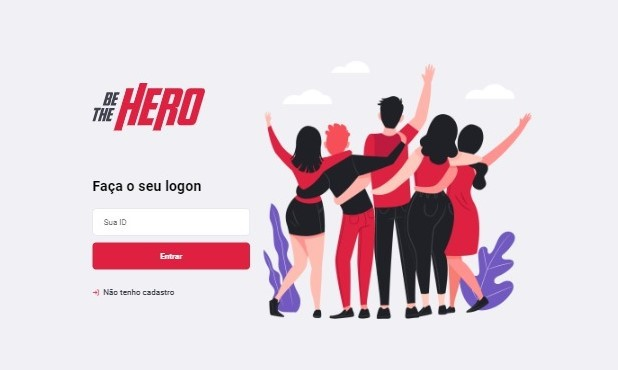
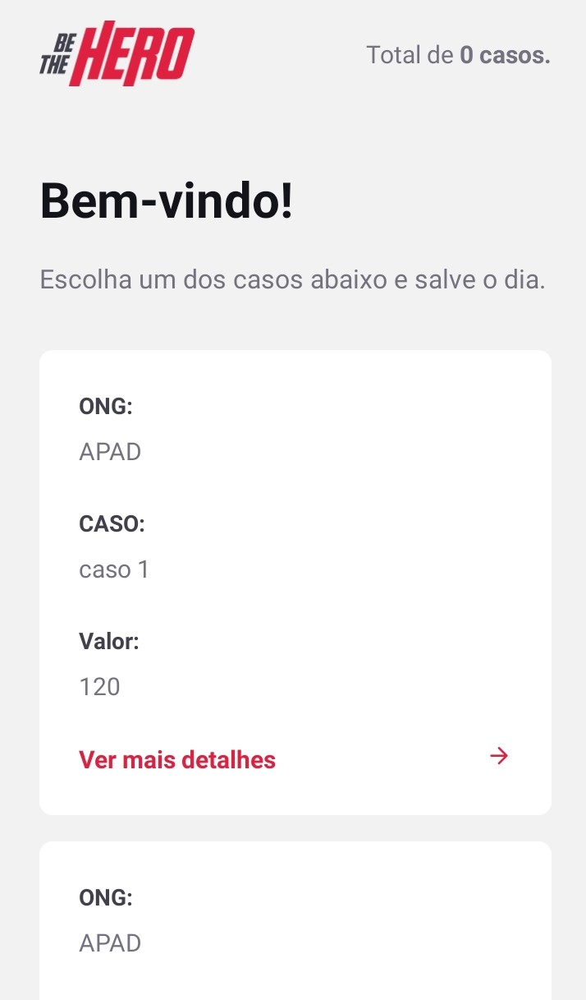

<h1 align="center">
    
</h1>

## 🔖 Layout

<h4 align="center">
  🚀 Semana OmniStack 11.0
</h4>
App desenvolvido durante a semna OmniStack11, uma iniciativa da RocketSeat para ajudar programadores a aprender novas tecnologias para o desenvolvimento web.

## 🚀 Tecnologias

Esse projeto foi desenvolvido com as seguintes tecnologias:

- [Node.js](https://nodejs.org/en/)
- [React](https://reactjs.org)
- [React Native](https://facebook.github.io/react-native/)
- [Expo](https://expo.io/)

## 💻 Projeto

O Be The Hero é uma aplicação com o própoito de ajudar ONGs, nele elas se cadastram e tambem adicionam os casos que elas presisam de doação. No app o usuario escolhe o caso que ele deseja doar e depois ele seleciona uma das formas de contato: WhasApp ou E-mail.
